# AgentOS Examples

Real-world code and execution examples demonstrating the core principles of AgentOS. Each example shows what default LLM agents commonly do wrong and how AgentOS forces them to act correctly.

---

## 1. Risk-Tiered Autonomy



### Example: Modifying Authentication Flow

**User Request:** "Update the login function to require a 2FA token."

**❌ What Default LLMs Do (Silent Execution / Blind Edits)**
They immediately rewrite the `login` function, often deleting crucial error handling or breaking existing sessions, without ever pausing to ask if this is safe.

**✅ What AgentOS Does (T3 Mandatory HITL)**
```
[AgentOS Execution Halted]
Action: Modifying Auth Flow (T3 Action)
Rule Triggered: `[HARD CONSTRAINT - CONSTITUTIONAL CHANGES / AUTH EDITS]`

I have drafted the 2FA login update. Because this touches authentication, it requires explicit Red Team review before I can commit it.

Please review the proposed diff below:
+ function login(username, password, token) { ... }
- function login(username, password) { ... }

Approve? (Yes / No / Modify)
```

---

## 2. Idempotency & The Recovery Kernel


### Example: Replacing a block of code

**User Request:** "Change the sorting algorithm in the table component to use QuickSort."

**❌ What Default LLMs Do (Idempotency Neglect)**
If their regex or line-matching fails to find the exact code, they often retry in a loop, hallucinate the file contents, or replace the entire file with incomplete code.

**✅ What AgentOS Does (Ensure, Don't Do)**
```
1. [AgentOS]: Executes `view_file` to read the exact target lines.
2. [AgentOS]: Copies the exact lines into the `TargetContent` field.
3. [AgentOS]: Applies the edit. 

If it fails on the first try due to a mismatch:
4. [AgentOS]: Re-reads the file ONCE. Retries ONCE.
5. [AgentOS]: Aborts execution and alerts the user rather than looping.
```

---

## 3. Transactional Memory Compression



### Example: Long-running Chat Session

**User Context:** The user has been working for 3 hours. The `worklog.md` is now 5,000 tokens long.

**❌ What Default LLMs Do (Context Bloat / Forgetting)**
The agent starts ignoring the first half of the conversation. It forgets earlier architectural decisions and begins hallucinating previous files. If instructed to "summarize memory", it might delete the memory file if the IDE crashes mid-write.

**✅ What AgentOS Does (5-Step Atomic Loop)**
When `worklog.md` > 4,000 tokens, it triggers:
1. **Distill**: Summarizes the 5,000 tokens into a dense 500-token snapshot.
2. **Append**: Writes the snapshot to `archive/2026-07-10_snapshot.md` and updates `archive/index.md`.
3. **Verify**: Uses `view_file` to ensure the archive exists on disk.
4. **Truncate**: Clears `worklog.md`.
5. **Commit**: Runs `git commit` so data is completely safe.

---

## 4. Frontier Delegation


### Example: Massive Architectural Rewrite

**User Request:** "Rewrite this entire monolithic Express.js backend into a microservices architecture." (100k+ tokens required)

**❌ What Default LLMs Do (God Model Syndrome)**
They attempt to do it all in one prompt response. They output 3,000 lines of code, truncate halfway through, and corrupt the workspace.

**✅ What AgentOS Does (Supervisor / Worker MAS)**
```
1. [AgentOS]: Recognizes this is a massive generation task.
2. [AgentOS]: Prepares a "Handoff Prompt" (scrubbing `.env` secrets).
3. [AgentOS]: Tells the user: "Feed this prompt to a Frontier Model (like Claude Fable 5 / GLM-5.2 or any frontier model that exists todate (not banned by China or USA lol)). Paste the output back here."
4. [AgentOS]: Receives the code, checks out a new git branch, injects the code *verbatim*, and presents the git diff for review.
```

---

## 5. OS Scaffolding



### Example: Starting a brand new project

**User Context:** The user opens an empty directory and types "Hello".

**❌ What Default LLMs Do (Speculative Wandering)**
They say "Hello! What can I help you with?" or they start randomly running `ls` to figure out where they are, wasting API calls.

**✅ What AgentOS Does (Strict Handshake)**
```
[AgentOS active | worklog: none (file missing) | pending: none]

I notice core state files like `worklog.md` and `business_context.md` are missing.

[Interactive Questionnaire Triggered]
Which files would you like me to scaffold for this new workspace?
[x] worklog.md
[x] business_context.md
[x] user_lexicon.md
```
