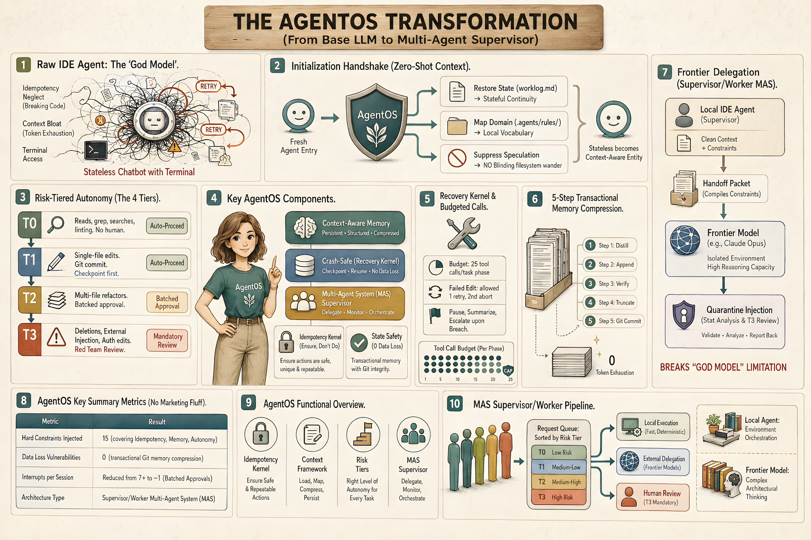

# DevOS



Simplemente copia la carpeta `.agents` en cualquier espacio de trabajo. El próximo agente que la abra leerá cuatro archivos antes de su primera respuesta — no será un simple chatbot genérico con acceso a la terminal.

## Qué Hace

Un agente IDE recién inicializado no conoce tu proyecto, tus estándares, tus patrones de error, ni lo que ocurrió ayer. DevOS cierra esas brechas con cuatro archivos:

| Archivo | Qué Hace |
|---|---|
| `rules/IDENTITY.md` | Tu declaración sobre qué es el proyecto, cómo se ve el trabajo terminado, y dónde tiene autonomía el agente vs. dónde te mantienes en el ciclo de decisión. |
| `rules/GROUNDING.md` | Calibración de comportamiento — cómo el agente implementa, se comunica, detecta sus propios errores e inicia cada sesión. |
| `current.md` | En qué está trabajando el agente en este momento, qué no está tocando, y cuándo se considera terminado. |
| `worklog.md` | Qué se hizo antes — para que la próxima sesión no comience desde cero. |

Dos archivos de reglas se inyectan en cada conversación (~700 tokens). Dos archivos dinámicos se leen al inicio de cada sesión. Ese es todo el sistema.

## Instalación

Copia `.agents/` en la raíz de tu proyecto. Completa `rules/IDENTITY.md` para tu proyecto. Listo.

## Qué Incluye

Más allá de los cuatro archivos principales, DevOS viene con:

- **11 habilidades (skills) seleccionadas** — bucles de razonamiento específicos y restricciones de formato para tareas concretas, no simples documentos de referencia que el agente podría leer por encima.
- **Calibración de habilidades** — el enrutamiento de SkillsBench carga solo las habilidades que una tarea necesita, en lugar de acumular las once en el contexto.
- **Gobernanza de evolución** — los agentes proponen nuevas habilidades y vocabulario, pero solo el humano las aprueba.
- **Compresión de contexto** — el archivado automático previene que los archivos de memoria crezcan sin límite.
- **Diccionario semántico** — mapea tus atajos y preferencias hacia comportamientos deterministas del agente.

## Filosofía

DevOS está construido sobre cuatro directivas respaldadas por evidencia:

1. **Pregunta, no asumas** — revela la incertidumbre antes de proceder (+3.7% éxito en tareas).
2. **Implementación mínima viable** — el código más pequeño que funcione, sin abstracciones especulativas.
3. **Disciplina de alcance** — toca solo lo que la tarea requiere (los agentes predeterminados triplican su tasa de errores graves en tareas de mantenimiento).
4. **Define el éxito, luego itera** — saber cómo se ve el trabajo terminado antes de escribir código.

Y un principio de diseño: **predictibilidad sobre perfección.** El humano no necesita un agente perfecto. Necesita uno cuyo comportamiento pueda aprender, cuyo alcance pueda verificar, y cuyos modos de fallo pueda compensar.

## Estructura del Proyecto

```
.agents/
├── rules/
│   ├── IDENTITY.md          ← Completa esto para tu proyecto
│   ├── GROUNDING.md         ← Calibración de comportamiento del agente
│   ├── EVOLUTION.md         ← Bucle de aprendizaje gobernado
│   ├── SKILL_ROUTING.md     ← Árbol de decisión de habilidades
│   └── business_context.md  ← Plantilla de grafo de conocimiento
├── AGENTS.md                ← Reglas de calibración de habilidades
├── current.md               ← Estado volátil de la tarea
├── worklog.md               ← Historial (solo adición)
├── memory/
│   ├── user_lexicon.md      ← Diccionario semántico
│   └── rejected_proposals.md
├── skills/                  ← 11 directorios de habilidades seleccionadas
├── telemetry/
│   └── runs.md
└── archive/
    └── index.md
```

## Licencia

MIT
