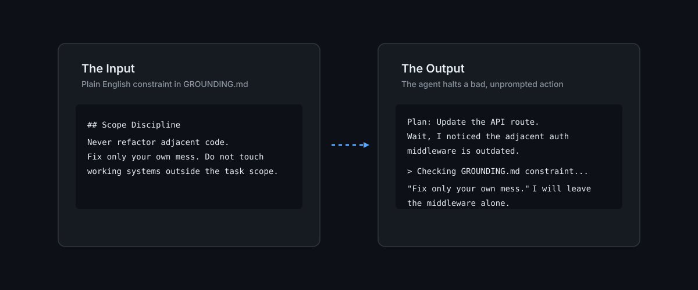

[](https://opensource.org/licenses/MIT)
[]()
[](https://github.com/chama-x/DevOS/stargazers)
[](https://github.com/chama-x/DevOS/actions/workflows/ci.yml)

> **DevOS — 4つのファイルで、IDEエージェントにプロジェクトのルール、現在のタスク、および履歴を与えます。**

```text
> Agent initialized.
> Reading .agents/rules/IDENTITY.md... [Project boundaries loaded]
> Reading .agents/rules/GROUNDING.md... [Behavioral constraints loaded]
> Reading .agents/worklog.md... [Session history restored]
> Ready. 
```



## クイックスタート

```bash
npx degit chama-x/DevOS/.agents .agents
vim .agents/rules/IDENTITY.md
# IDEエージェントを再起動します — これで毎回のチャットでプロジェクトのコンテキストを読み込みます。
```

## なぜDevOSなのか？

IDEエージェントは毎回のチャットをゼロから始めます。DevOSは彼らに記憶（あなたのルール、タスク、履歴）を与えることで、推測をやめ、構築を始めさせます。

## 機能

| 機能 | 役割 |
|---|---|
| **11のスキル** | タスクに必要な推論ループのみを読み込む |
| **スキルの調整** | タスクを自動的に適切なスキルにルーティングする |
| **ガバナンス** | エージェントが新しいスキルを提案し、あなたが承認する |
| **コンテキスト圧縮** | 肥大化する前に履歴をアーカイブする |
| **意味論的辞書** | あなたの略語を決定論的な行動にマッピングする |

## ドキュメントとコミュニティ

私たちは信頼、予測可能性、コラボレーションを重視します。
- [Changelog](CHANGELOG.md) - リリース履歴。
- [Contributing Guidelines](CONTRIBUTING.md) - すべてのPRをレビューします。`good first issue`から始めてください。
- [Code of Conduct](CODE_OF_CONDUCT.md) - コミュニティ標準。

## プロジェクト構造

```
.agents/
├── rules/
│   ├── IDENTITY.md          ← プロジェクトに合わせて記入
│   ├── GROUNDING.md         ← エージェントの行動調整
│   └── SKILL_ROUTING.md     ← スキルの決定木
├── current.md               ← タスクの揮発性状態
├── worklog.md               ← 追記専用の履歴
└── skills/                  ← 11の厳選されたスキルディレクトリ
```

## ライセンス

MIT
