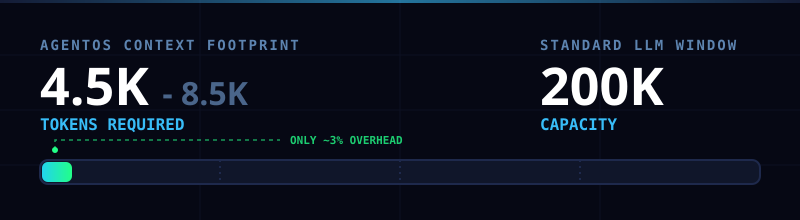

# AgentOS: The Self-Governing MAS Framework

## What's New: AgentOS Control Plane Dashboard 🚀
To open the dashboard, simply right-click `.agents/agentos-dashboard.html` and select **"Open with Live Server"** in your IDE.

  

Modern IDEs ship with powerful base LLM agents, but in their default state, they are essentially stateless chatbots with terminal access. They suffer from "Idempotency Neglect" (breaking code by retrying bad edits), context bloat (memory exhaustion), and "God Model" syndrome (trying to solve 100k-token problems in a 4k-token window).

We engineered a **Custom AgentOS Context Framework** that sits above the IDE agent. The moment a "fresh" agent wakes up in this environment, it is instantly transformed by local configuration files into a **Self-Governing, Risk-Tiered Supervisor**.

  

## Core Features

### 1. Risk-Tiered Autonomy
Fresh agents treat all tasks equally. Our AgentOS injects a strict 4-Tier Autonomy system:
- **T0**: Reads, searches, linting (Auto-Proceed).
- **T1**: Single-file edits (Auto-Proceed. Must `git commit` a checkpoint first).
- **T2**: Multi-file refactors (Batched Approval).
- **T3**: Deletions, External Injection, Auth edits (Mandatory Red Team Review).

### 2. Idempotency & The Recovery Kernel
Every mutation must first verify if its effect already exists. If a surgical text replacement fails, the agent is allowed *one* retry. On the second failure, it must abort, preventing infinite execution loops.

### 3. Transactional Memory Compression
When the `worklog.md` memory exceeds 4,000 tokens, the agent runs a transactional 5-step loop: Distill → Append → Verify → Truncate → Commit. This provides a 100% guarantee against context data loss during LLM crashes.

### 4. Frontier Delegation (Supervisor/Worker MAS)
When a task requires extreme logic (40k+ tokens), the OS triggers a handoff packet. The agent scrubs secrets and API keys, and compiles a dense prompt for an external Frontier Model. When the code returns, it is injected verbatim, statically analyzed, and presented as a `git diff` for a T3 human review.

### 5. Constitutional Lock & OS Scaffolding
The agent cannot rewrite its own guardrails. Any edit to the `.agents/rules/` directory is permanently classified as a **T3 action**. Additionally, if core files are missing on startup, the agent will automatically trigger a multi-select questionnaire to scaffold the workspace.

### 6. Control Plane Dashboard
A premium dark-mode dashboard (`agentos-dashboard.html`) is built directly inside the `.agents/` folder. It provides a visual interface for:
- **System Overview**: Live tracking of the current active phase from `STATE.md`, recent telemetry runs, and active skill count.
- **Skills Explorer**: Interactive cards for all 62 skills, filterable by tags, with live search and markdown rendering of `SKILL.md` documents. Includes an inline editor with direct-save (File System Access API) and fallback download capabilities.
- **Rules Configurator**: Tabbed editor and viewer for core system configurations (`SKILL_ROUTING.md`, `AGENTS.md`, `EVOLUTION.md`, `business_context.md`).
- **State Anchor & Question Logs**: Visualizes the phase-machine timeline alongside interactive question histories and security approval tokens.
- **Telemetry Ledger**: High-fidelity run lists documenting all tool execution runs and outcomes.
- **Memory Root**: User Lexicon definitions, rejected proposals, and compression snapshot timelines.

## Installation
Just drop the `.agents` folder into the root of your workspace, and your agent will instantly transform into the V2 Supervisor!
