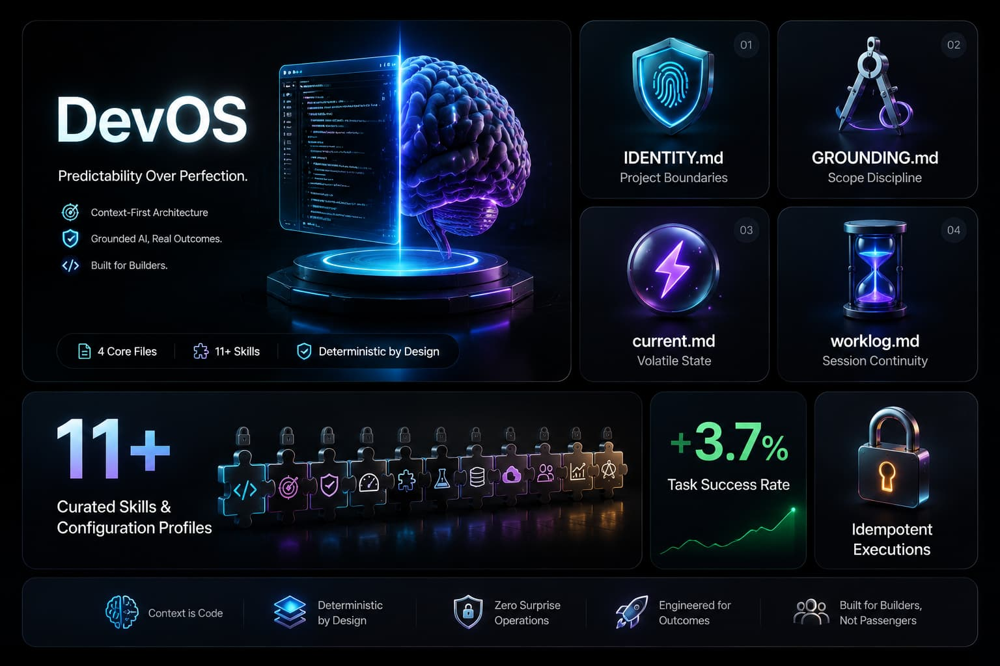
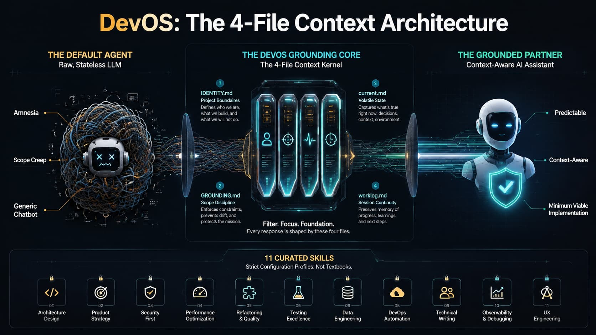

将 `.agents` 文件夹放入任何工作区。接下来打开它的智能体（Agent）在给出第一次回复前会先读取四个文件——它不再是一个仅仅带有终端访问权限的通用聊天机器人。

## 它的作用

一个刚启动的 IDE 智能体并不了解你的项目、你的规范、你的故障模式，或者昨天发生过什么。DevOS 通过四个文件来填补这些上下文空白：

| 文件 | 作用 |
|---|---|
| `rules/IDENTITY.md` | 你的项目声明：项目是什么，完成的标准是什么，智能体在哪些方面拥有自主权，以及你在哪些方面需要保持知情和决策权。 |
| `rules/GROUNDING.md` | 行为校准——规定智能体应如何实现代码、如何沟通、如何捕获自身的错误以及如何启动每个会话。 |
| `current.md` | 智能体目前正在处理什么，哪些部分是不该碰的，以及何时算作完成。 |
| `worklog.md` | 之前做了什么——以便下一次会话不会从零开始。 |

每场对话都会注入两个规则文件（大约 700 tokens）。在会话开始时会读取两个动态文件。这就是整个系统的核心。



## 安装

将 `.agents/` 复制到你的项目根目录。为你的项目填写 `rules/IDENTITY.md`。安装完成。

## 包含的内容

除了这四个核心文件，DevOS 还附带：

- **11 项精选技能 (Skills)** —— 针对特定任务的狭窄推理循环和输出约束，而不是智能体可能会随便扫一眼的通用参考文档。
- **技能校准** —— SkillsBench 路由策略只加载任务所需的技能，而不是将全部 11 项技能堆叠进上下文中。
- **演进治理** —— 智能体可以提出新的技能和词汇建议，但只有人类才能批准。
- **上下文压缩** —— 自动归档功能防止记忆文件无限制地膨胀。
- **语义字典** —— 将你的速记词和偏好映射到确定性的智能体行为上。

## 理念

DevOS 建立在四项经过证据支持的指令之上：

1. **先问，不要猜** —— 在继续之前浮现并确认不确定性（任务成功率提升 3.7%）。
2. **最小可行实现** —— 编写能让功能跑起来的最小代码，不进行投机性的抽象。
3. **范围纪律** —— 只触碰任务需要的部分（默认智能体在维护任务中的破坏性变更率通常会翻三倍）。
4. **先定义成功，再循环执行** —— 在写代码之前，要知道“完成”是什么样子的。

以及一个设计原则：**可预测性高于完美。** 人类不需要一个完美的智能体。他们需要的是一个行为可以被学习、作用范围可以被验证、且其失败模式可以被补偿的智能体。

## 项目结构

```
.agents/
├── rules/
│   ├── IDENTITY.md          ← 为你的项目填写此文件
│   ├── GROUNDING.md         ← 智能体行为校准
│   ├── EVOLUTION.md         ← 受控的学习循环
│   ├── SKILL_ROUTING.md     ← 技能决策树
│   └── business_context.md  ← 知识图谱模板
├── AGENTS.md                ← 技能校准规则
├── current.md               ← 易失性任务状态
├── worklog.md               ← 仅追加的历史记录
├── memory/
│   ├── user_lexicon.md      ← 语义字典
│   └── rejected_proposals.md
├── skills/                  ← 11 个精选技能目录
├── telemetry/
│   └── runs.md
└── archive/
    └── index.md
```

## 许可证

MIT
