[](https://opensource.org/licenses/MIT)
[]()
[](https://github.com/chama-x/DevOS/stargazers)
[](https://github.com/chama-x/DevOS/actions/workflows/ci.yml)

> **DevOS — 用四个文件，让任何 IDE 智能体拥有你项目的规则、当前任务和历史记录。**

```text
> Agent initialized.
> Reading .agents/rules/IDENTITY.md... [Project boundaries loaded]
> Reading .agents/rules/GROUNDING.md... [Behavioral constraints loaded]
> Reading .agents/worklog.md... [Session history restored]
> Ready. 
```


## 快速开始

```bash
npx degit chama-x/DevOS/.agents .agents
vim .agents/rules/IDENTITY.md
# 重启你的 IDE 智能体 —— 它现在每次对话都会读取项目上下文。
```

## 为什么选择 DevOS？

IDE 智能体每次对话都从零开始。DevOS 赋予它们记忆——你的规则、你的任务、你的历史——这样它们就不再瞎猜，而是直接开始工作。

## DevOS vs. 原始提示词

单文件 `.cursorrules` 与提示词包每次对话都会倾倒数千个 Token。DevOS 用 4 个结构化文件与按需路由替代它们。

| 能力 | 原始提示词 (.cursorrules / CLAUDE.md) | DevOS |
|---|---|---|
| **上下文占用** | 每次对话加载 5,000+ Tokens | 仅加载 ~700 核心 Tokens |
| **会话历史** | 新对话立即清零 | 从 `worklog.md` 恢复进度 |
| **技能加载** | 一次性加载所有规则 | 按需最多加载 2–3 项技能 |
| **范围纪律** | 智能体可忽略的软建议 | 首次响应前强制检查硬约束 |
| **项目边界** | 未声明 | 在 `IDENTITY.md` 中明确定义 |


## 功能特性

| 特性 | 作用 |
|---|---|
| **11 项技能** | 仅加载任务所需的推理循环 |
| **技能校准** | 自动将任务路由到正确的技能 |
| **演进治理** | 智能体提出新技能，由你来批准 |
| **上下文压缩** | 在历史记录无限膨胀前进行归档 |
| **语义字典** | 将你的简写映射为确定性行为 |

## 文档与社区

我们重视信任、可预测性和协作。
- [更新日志](CHANGELOG.md) - 查看发布历史。
- [贡献指南](CONTRIBUTING.md) - 我们会审查每一个 PR，请从 `good first issue` 开始。
- [行为准则](CODE_OF_CONDUCT.md) - 我们的社区标准。

## 项目结构

```
.agents/
├── rules/
│   ├── IDENTITY.md          ← 为你的项目填写此文件
│   ├── GROUNDING.md         ← 智能体行为校准
│   └── SKILL_ROUTING.md     ← 技能决策树
├── current.md               ← 易失性任务状态
├── worklog.md               ← 仅追加的历史记录
└── skills/                  ← 11 个精选技能目录
```

## 许可证

MIT
